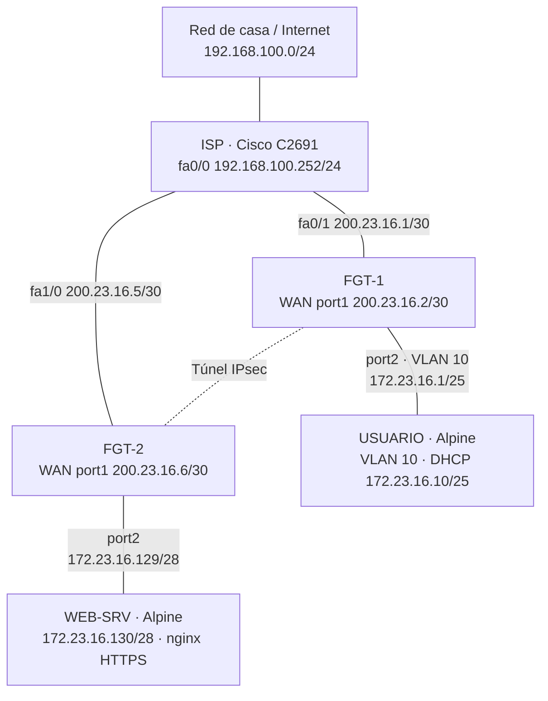
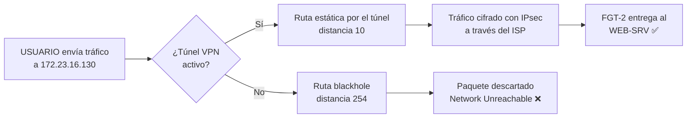

# Infraestructura 1 — VPN Site-to-Site entre dos FortiGate

**Estudiante:** Abdul Djalo · **Matrícula:** 2023-1600

## 1. Propósito

Comunicar un **usuario** y un **servidor web HTTPS** ubicados en dos sitios distintos, cada uno protegido por un FortiGate, a través de un **túnel VPN IPsec site-to-site** que atraviesa un ISP con direccionamiento público. El laboratorio demuestra además que **la comunicación solo fluye mientras el túnel VPN está activo**.

## 2. Objetivos

- Configurar la red de dos FortiGate (WAN, LAN y VLAN) por GUI.
- Aplicar NAT para la salida a Internet de cada red interna.
- Establecer una VPN IPsec site-to-site entre ambos FortiGate.
- Simular un ISP con direcciones IP públicas.
- Publicar un servidor web HTTPS en una red /28.
- Ofrecer DHCP a los usuarios en la VLAN 10 (red /25).
- Verificar el camino con traceroute y comprobar que, sin VPN, no hay comunicación.

## 3. Topología

### 3.1 Topología en PNetLab


### 3.2 Diagrama lógico



### 3.3 Comportamiento del tráfico hacia el servidor



## 4. Equipos

| Nodo | Imagen | Recursos | Función |
|---|---|---|---|
| ISP | Cisco C2691 (Dynamips) + NM-1FE-TX en slot 1 | por defecto | Router del proveedor con IP públicas |
| FGT-1 | FortiGate-VM 7.0.9 | 1 vCPU, 1 GB RAM | Firewall del sitio de usuarios |
| FGT-2 | FortiGate-VM 7.0.9 | 1 vCPU, 1 GB RAM | Firewall del sitio del servidor |
| USUARIO | Alpine Linux 3.20 | 1 vCPU, 256 MB | Cliente en VLAN 10 |
| WEB-SRV | Alpine Linux 3.20 | 1 vCPU, 256 MB | Servidor web nginx HTTPS |
| Net | Management (Cloud0) | — | Salida del ISP hacia la red física |

## 5. Direccionamiento

El direccionamiento se basa en la matrícula **2023-1600** → **23.16**.

| Equipo | Interfaz | Dirección | Conecta a |
|---|---|---|---|
| ISP | fa0/0 | 192.168.100.252/24 | Net (red física) |
| ISP | fa0/1 | 200.23.16.1/30 | FGT-1 port1 |
| ISP | fa1/0 | 200.23.16.5/30 | FGT-2 port1 |
| FGT-1 | port1 (WAN) | 200.23.16.2/30 | ISP |
| FGT-1 | VLAN10 sobre port2 (USUARIOS) | 172.23.16.1/25 | USUARIO |
| FGT-2 | port1 (WAN) | 200.23.16.6/30 | ISP |
| FGT-2 | port2 (SERVIDORES) | 172.23.16.129/28 | WEB-SRV |
| USUARIO | eth0.10 | DHCP (rango .10 – .120) | FGT-1 |
| WEB-SRV | eth0 | 172.23.16.130/28 | FGT-2 |

| Red | Uso | Gateway |
|---|---|---|
| 172.23.16.0/25 | Usuarios (VLAN 10) | 172.23.16.1 |
| 172.23.16.128/28 | Servidores | 172.23.16.129 |
| 200.23.16.0/30 | Enlace ISP – FGT-1 | 200.23.16.1 |
| 200.23.16.4/30 | Enlace ISP – FGT-2 | 200.23.16.5 |

## 6. Configuración

### 6.1 ISP (Cisco)

Interfaces con IP públicas, ruta por defecto hacia la red física y NAT (PAT) para simular la salida a Internet. El ISP **no conoce las redes privadas** 172.23.16.x, igual que un proveedor real; por eso solo pueden comunicarse a través de la VPN.

La ACL 101 excluye del NAT el tráfico hacia la red de gestión (192.168.100.0/24) para no romper el acceso a la GUI de los FortiGate.

Comandos completos: [`scripts/isp-config.txt`](scripts/isp-config.txt) · Running-config: [`configs/ISP-running-config.txt`](configs/ISP-running-config.txt)

### 6.2 Acceso de gestión

El PC de administración (Windows) llega a las IP públicas a través del ISP con una ruta estática:

```
route -p add 200.23.16.0 mask 255.255.255.248 192.168.100.252
```

La GUI se abre en `http://200.23.16.2` (FGT-1) y `http://200.23.16.6` (FGT-2).

### 6.3 Configuración inicial mínima de los FortiGate (bootstrap)

Antes de poder usar la GUI, por consola solo se configuró lo imprescindible para alcanzarla: IP de port1, acceso administrativo y ruta por defecto. **El resto de la configuración se hizo por GUI.**

```
config system interface
edit port1
set mode static
set ip 200.23.16.2 255.255.255.252
set allowaccess ping http https ssh
end
config router static
edit 1
set gateway 200.23.16.1
set device port1
end
```

En FGT-2 se usaron `200.23.16.6 255.255.255.252` y el gateway `200.23.16.5`.

### 6.4 Red en los FortiGate (GUI)

**FGT-1**
- *System > Settings*: hostname `FGT-1`.
- *Network > Interfaces > port1*: alias `WAN`.
- *Network > Interfaces > Create New > Interface*: `VLAN10` (alias `USUARIOS`), tipo VLAN sobre port2, VLAN ID 10, IP `172.23.16.1/25`, acceso PING, **servidor DHCP** con rango `172.23.16.10 – 172.23.16.120`, gateway igual a la IP de la interfaz y DNS `8.8.8.8`.


**FGT-2**
- *System > Settings*: hostname `FGT-2`.
- *Network > Interfaces > port1*: alias `WAN`.
- *Network > Interfaces > port2*: alias `SERVIDORES`, IP `172.23.16.129/28`, acceso PING.


### 6.5 NAT (GUI)

En *Policy & Objects > Firewall Policy* se creó en cada FortiGate una política de salida a Internet con **NAT usando la IP de la interfaz de salida**:

| FortiGate | Política | Origen | Entrada → Salida | NAT |
|---|---|---|---|---|
| FGT-1 | USR-a-Internet | VLAN10 address | USUARIOS (VLAN10) → WAN (port1) | Activado |
| FGT-2 | SRV-a-Internet | all | SERVIDORES (port2) → WAN (port1) | Activado |


### 6.6 VPN IPsec site-to-site (GUI)

Se usó *VPN > IPsec Wizard* con la plantilla **Site to Site – FortiGate**, sin NAT entre sitios y autenticación por **clave precompartida**.

| Parámetro | FGT-1 | FGT-2 |
|---|---|---|
| Nombre | VPN-A-FGT2 | VPN-A-FGT1 |
| IP remota | 200.23.16.6 | 200.23.16.2 |
| Interfaz de salida | WAN (port1) | WAN (port1) |
| Interfaz local | USUARIOS (VLAN10) | SERVIDORES (port2) |
| Subred local | 172.23.16.0/25 | 172.23.16.128/28 |
| Subred remota | 172.23.16.128/28 | 172.23.16.0/25 |
| Acceso a Internet | None | None |

El asistente creó en cada FortiGate: interfaces de fase 1 y 2, grupos de direcciones local y remoto, **una ruta estática hacia la subred remota por el túnel**, **una ruta blackhole** (distancia 254) y las políticas en ambos sentidos.


La ruta blackhole es la que garantiza el segundo objetivo: si el túnel cae, la ruta por el túnel desaparece, la blackhole pasa a ser la ruta activa y el tráfico se descarta en lugar de salir sin cifrar por la WAN.

### 6.7 USUARIO (Alpine)

Interfaz etiquetada en la VLAN 10 (`eth0.10`) que obtiene su dirección por DHCP del FGT-1.

Script: [`scripts/usuario-setup.sh`](scripts/usuario-setup.sh) · Configuración: [`configs/USUARIO-interfaces`](configs/USUARIO-interfaces)

### 6.8 WEB-SRV (Alpine)

IP estática, nginx escuchando en el puerto 443 con un certificado autofirmado (RSA 2048) y página de prueba.

Script: [`scripts/websrv-setup.sh`](scripts/websrv-setup.sh) · Configuración: [`configs/WEB-SRV-interfaces`](configs/WEB-SRV-interfaces), [`configs/WEB-SRV-nginx-default.conf`](configs/WEB-SRV-nginx-default.conf)

## 7. Pruebas y resultados

### 7.1 DHCP en la VLAN 10

```
USUARIO:~# ip addr show eth0.10
3: eth0.10@eth0: <BROADCAST,MULTICAST,UP,LOWER_UP> mtu 1500 qdisc noqueue state UP
    inet 172.23.16.10/25 scope global eth0.10
```

El usuario recibe `172.23.16.10/25` del servidor DHCP de FGT-1.

### 7.2 Con la VPN activa


```
USUARIO:~# ping -c 10 172.23.16.130
64 bytes from 172.23.16.130: seq=1 ttl=62 time=43.401 ms
64 bytes from 172.23.16.130: seq=2 ttl=62 time=18.946 ms
...
```

```
USUARIO:~# traceroute 172.23.16.130
 1  172.23.16.1 (172.23.16.1)      1.706 ms
 2  200.23.16.6 (200.23.16.6)     15.227 ms
 3  172.23.16.130 (172.23.16.130) 20.035 ms
```

```
USUARIO:~# wget --no-check-certificate -qO- https://172.23.16.130
<h1>WEB-SRV - Infraestructura 1 - Abdul Djalo 2023-1600</h1>
```

**Análisis del traceroute:** el camino es FGT-1 → FGT-2 → servidor. **El ISP (200.23.16.1 / 200.23.16.5) no aparece como salto**, lo que demuestra que el tráfico lo atraviesa **encapsulado dentro del túnel IPsec**. El salto 2 muestra la IP pública de FGT-2 porque la interfaz del túnel no tiene IP propia.

### 7.3 Con la VPN caída

Se deshabilitó la interfaz del túnel `VPN-A-FGT2` en *Network > Interfaces* de FGT-1.

```
USUARIO:~# ping -c 5 172.23.16.130
5 packets transmitted, 0 packets received, 100% packet loss
```

```
USUARIO:~# traceroute 172.23.16.130
 1  172.23.16.1 (172.23.16.1)  1.974 ms !N  0.703 ms !N  0.586 ms !N
```

El traceroute se detiene en FGT-1 con `!N` (*Network Unreachable*): la ruta activa hacia 172.23.16.128/28 es la **blackhole**.


### 7.4 Recuperación

Al volver a habilitar el túnel, la comunicación se restablece (ping y HTTPS funcionan de nuevo). La pérdida del primer paquete corresponde al tiempo de negociación del túnel.

| Prueba | VPN activa | VPN caída |
|---|---|---|
| Ping USUARIO → WEB-SRV | ✅ | ❌ 100 % pérdida |
| Traceroute | ✅ 3 saltos | ❌ `!N` en FGT-1 |
| HTTPS (wget) | ✅ Página recibida | ❌ Sin respuesta |

## 8. Limitaciones y decisiones del entorno

- **Versión de FortiGate:** se usó 7.0.9 porque no exige licencia FortiCare y consume 1 GB de RAM por equipo, lo que permite ejecutar los dos FortiGate en el host disponible (8 GB RAM). La versión 7.6.2 requiere una licencia de evaluación por cuenta y 2 GB por equipo.
- **Licencia de evaluación:** la VM funciona en modo evaluación (FGVMEV) con validez de 15 días, 1 vCPU y hasta 2 GB de RAM.
- **Cifrado:** el modo de evaluación solo permite **cifrado bajo (DES)** en IPsec. La VPN funciona y cifra el tráfico, pero **en producción se usaría AES-256 con SHA-256 y grupos DH 14 o superiores**.
- **GUI por HTTP:** la versión usada presenta un error del certificado HTTPS de administración ("ee key too small"), por lo que la GUI se usó por HTTP. En producción se accedería solo por HTTPS desde una red de gestión dedicada.
- **Bootstrap por CLI:** la IP de la WAN, el acceso administrativo y la ruta por defecto se configuraron por consola, porque sin ellos no se puede llegar a la GUI.
- **Acceso de gestión por la WAN:** para no añadir nodos fuera del diagrama, se administra a través del ISP con una ruta estática en el PC.
- **Salida a Internet del ISP:** el ISP hace NAT hacia la red física para simular Internet y permitir instalar paquetes (nginx) en los servidores.
- **VLAN sin switch:** el diagrama conecta el usuario directamente al FortiGate, así que la VLAN 10 se implementó como sub-interfaz en FGT-1 y como interfaz etiquetada (`eth0.10`) en el Alpine.
- **Alpine:** tras modificar archivos se ejecuta `sync`, y los nodos se apagan con `poweroff` antes de detenerlos en PNetLab, para evitar archivos vacíos o corruptos.

## 9. Archivos

| Carpeta | Contenido |
|---|---|
| [`configs/`](configs/) | `FGT-1.conf`, `FGT-2.conf`, `ISP-running-config.txt`, `USUARIO-interfaces`, `WEB-SRV-interfaces`, `WEB-SRV-nginx-default.conf` |
| [`scripts/`](scripts/) | `isp-config.txt`, `usuario-setup.sh`, `websrv-setup.sh` |
| [`imagenes/`](imagenes/) | Capturas de la configuración y de las pruebas |
| [`diagramas/`](diagramas/) | Diagramas de la topología |
