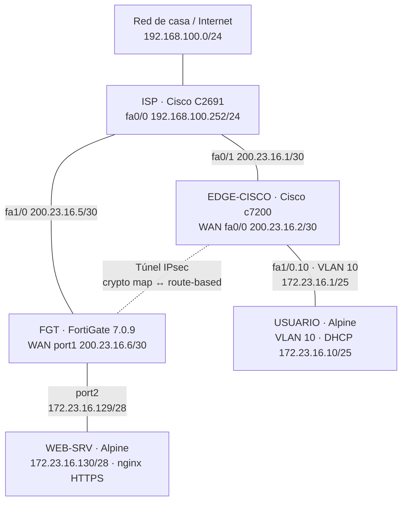
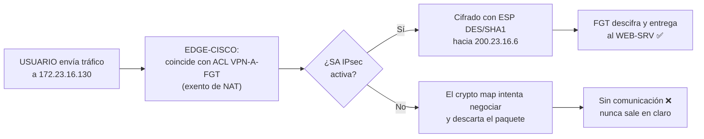

# Infraestructura 2 — VPN Site-to-Site entre FortiGate y Cisco

**Estudiante:** Abdul Djalo · **Matrícula:** 2023-1600

## 1. Propósito

Comunicar un **usuario** y un **servidor web HTTPS** ubicados en dos sitios distintos a través de un **túnel VPN IPsec site-to-site entre equipos de fabricantes diferentes**: un router **Cisco** en el sitio del usuario y un **FortiGate** en el sitio del servidor. El laboratorio demuestra la interoperabilidad de IPsec entre ambos fabricantes y que **la comunicación solo fluye mientras el túnel VPN está activo**.

## 2. Objetivos

- Configurar la red, el NAT y la VPN en un FortiGate, todo por GUI.
- Configurar la red, la VLAN 10, el DHCP, el NAT y la VPN en un router Cisco.
- Establecer una VPN IPsec site-to-site entre el FortiGate y el Cisco, con parámetros idénticos en ambos lados.
- Simular un ISP con direcciones IP públicas.
- Publicar un servidor web HTTPS en una red /28.
- Verificar el camino con traceroute y comprobar que, sin VPN, no hay comunicación.

## 3. Topología

### 3.1 Topología en PNetLab


### 3.2 Diagrama lógico



### 3.3 Comportamiento del tráfico hacia el servidor



## 4. Equipos

| Nodo | Imagen | Recursos | Función |
|---|---|---|---|
| ISP | Cisco C2691 (Dynamips, IOS 12.4) + NM-1FE-TX en slot 1 | por defecto | Router del proveedor con IP públicas |
| EDGE-CISCO | Cisco c7200 (Dynamips, IOS 15.2(4)S6) + PA-FE-TX en slot 1 | por defecto | Equipo de red del sitio de usuarios |
| FGT | FortiGate-VM 7.0.9 | 1 vCPU, 1 GB RAM | Firewall del sitio del servidor |
| USUARIO | Alpine Linux 3.20 | 1 vCPU, 256 MB | Cliente en VLAN 10 |
| WEB-SRV | Alpine Linux 3.20 | 1 vCPU, 256 MB | Servidor web nginx HTTPS |
| Net | Management (Cloud0) | — | Salida del ISP hacia la red física |

## 5. Direccionamiento

Basado en la matrícula **2023-1600** → **23.16**.

| Equipo | Interfaz | Dirección | Conecta a |
|---|---|---|---|
| ISP | fa0/0 | 192.168.100.252/24 | Net (red física) |
| ISP | fa0/1 | 200.23.16.1/30 | EDGE-CISCO fa0/0 |
| ISP | fa1/0 | 200.23.16.5/30 | FGT port1 |
| EDGE-CISCO | fa0/0 (WAN) | 200.23.16.2/30 | ISP |
| EDGE-CISCO | fa1/0.10 (VLAN 10) | 172.23.16.1/25 | USUARIO |
| FGT | port1 (WAN) | 200.23.16.6/30 | ISP |
| FGT | port2 (SERVIDORES) | 172.23.16.129/28 | WEB-SRV |
| USUARIO | eth0.10 | DHCP (rango .10 – .120) | EDGE-CISCO |
| WEB-SRV | eth0 | 172.23.16.130/28 | FGT |

## 6. Configuración

### 6.1 ISP (Cisco C2691)

Igual que en la Infraestructura 1: IP públicas, ruta por defecto hacia la red física y NAT hacia ella, excluyendo la red de gestión. Además se configuró `duplex full` en fa0/1 para corregir un *duplex mismatch* detectado por CDP con EDGE-CISCO.

Comandos: [`scripts/isp-config.txt`](scripts/isp-config.txt)

### 6.2 EDGE-CISCO (Cisco c7200, CLI)

**Red y VLAN 10:** sub-interfaz `fa1/0.10` con `encapsulation dot1Q 10`.

**DHCP:** pool `VLAN10-USUARIOS` con las direcciones .1–.9 y .121–.127 excluidas, gateway 172.23.16.1 y DNS 8.8.8.8.

**NAT con exención para la VPN:** la ACL `NAT-USUARIOS` **deniega** el tráfico 172.23.16.0/25 → 172.23.16.128/28 para que no se traduzca y pueda entrar al túnel con sus IP originales. El resto del tráfico sale a Internet con PAT por fa0/0.

**VPN (policy-based, crypto map):**
- `crypto isakmp policy 10`: DES, SHA, pre-share, grupo 14, 86400 s. En el running-config solo aparecen `authentication` y `group` porque DES, SHA y 86400 son los valores por defecto de este IOS.
- `crypto ipsec transform-set TS-DES esp-des esp-sha-hmac`, modo túnel.
- ACL `VPN-A-FGT` con el tráfico interesante: 172.23.16.0/25 → 172.23.16.128/28.
- `crypto map MAPA-VPN` con peer 200.23.16.6 y PFS grupo 14, aplicado a fa0/0.

Comandos: [`scripts/edge-cisco-config.txt`](scripts/edge-cisco-config.txt) · Running-config: [`configs/EDGE-CISCO-running-config.txt`](configs/EDGE-CISCO-running-config.txt) (clave IKE ocultada)

### 6.3 FortiGate: bootstrap por CLI

Como en la Infraestructura 1, por consola solo se configuró lo necesario para llegar a la GUI: IP de port1 (200.23.16.6/30), acceso administrativo y ruta por defecto hacia 200.23.16.5. **Todo lo demás se hizo por GUI.**

### 6.4 FortiGate: red y NAT (GUI)

- *System > Settings*: hostname `FGT`.
- *Network > Interfaces*: port1 con alias `WAN`; port2 con alias `SERVIDORES`, IP 172.23.16.129/28, acceso PING y objeto de dirección `port2 address`.
- *Policy & Objects > Firewall Policy*: `SRV-a-Internet` (port2 → port1, origen `port2 address`) con **NAT** usando la IP de la interfaz de salida.


### 6.5 FortiGate: VPN (GUI)

*VPN > IPsec Wizard*, plantilla **Site to Site** con **Remote device type: Cisco**:

| Parámetro | Valor |
|---|---|
| Nombre | VPN-A-CISCO |
| IP remota | 200.23.16.2 |
| Interfaz de salida | WAN (port1) |
| Interfaz local | SERVIDORES (port2) |
| Subred local | 172.23.16.128/28 |
| Subred remota | 172.23.16.0/25 |

Después, con *Convert To Custom Tunnel*, se ajustaron las propuestas para que coincidan exactamente con el Cisco. Así quedó en el backup:

```
config vpn ipsec phase1-interface
    edit "VPN-A-CISCO"
        set interface "port1"
        set proposal des-sha1
        set dhgrp 14
        set remote-gw 200.23.16.2
config vpn ipsec phase2-interface
    edit "VPN-A-CISCO"
        set proposal des-sha1
        set dhgrp 14
        set auto-negotiate enable
```

El asistente creó además la ruta hacia 172.23.16.0/25 por el túnel, la **ruta blackhole** (distancia 254) y las políticas `vpn_VPN-A-CISCO_local_0` y `vpn_VPN-A-CISCO_remote_0`.


### 6.6 Parámetros de la VPN en ambos extremos

| Parámetro | EDGE-CISCO | FGT |
|---|---|---|
| IKE | v1, Main mode | v1, Main mode |
| Fase 1 | DES / SHA / grupo 14 / 86400 s | des-sha1 / dhgrp 14 / 86400 s |
| Fase 2 | esp-des esp-sha-hmac | des-sha1 |
| PFS | group14 | dhgrp 14 |
| Selectores | 172.23.16.0/25 → 172.23.16.128/28 | 172.23.16.128/28 → 172.23.16.0/25 |
| Tipo | Policy-based (crypto map) | Route-based (interfaz de túnel) |

### 6.7 USUARIO y WEB-SRV (Alpine)

Misma configuración que en la Infraestructura 1. El DHCP y la VLAN 10 del usuario ahora los proporciona el Cisco, y la página del servidor indica "Infraestructura 2".

Scripts: [`scripts/usuario-setup.sh`](scripts/usuario-setup.sh), [`scripts/websrv-setup.sh`](scripts/websrv-setup.sh)

## 7. Pruebas y resultados

### 7.1 DHCP en la VLAN 10

```
EDGE-CISCO#show ip dhcp binding
IP address       Client-ID/              Lease expiration        Type       State
172.23.16.10     0150.a965.0011.00       Oct 01 2026 02:10 PM    Automatic  Active
                                                                 FastEthernet1/0.10
```

### 7.2 Túnel establecido

```
EDGE-CISCO#show crypto isakmp sa
dst             src             state          conn-id status
200.23.16.2     200.23.16.6     QM_IDLE           1001 ACTIVE

EDGE-CISCO#show crypto ipsec sa | include pkts
    #pkts encaps: 19, #pkts encrypt: 19, #pkts digest: 19
    #pkts decaps: 16, #pkts decrypt: 16, #pkts verify: 16
```

`QM_IDLE` indica que la fase 1 está completa. Los contadores de encapsulado y desencapsulado confirman tráfico cifrado en ambos sentidos.


### 7.3 Con la VPN activa

```
USUARIO:~# ping -c 10 172.23.16.130
64 bytes from 172.23.16.130: seq=0 ttl=62 time=86.617 ms
64 bytes from 172.23.16.130: seq=1 ttl=62 time=37.147 ms

USUARIO:~# traceroute 172.23.16.130
 1  172.23.16.1 (172.23.16.1)      15.350 ms
 2  *  *  *
 3  172.23.16.130 (172.23.16.130)  29.851 ms

USUARIO:~# wget --no-check-certificate -qO- https://172.23.16.130
<h1>WEB-SRV - Infraestructura 2 - Abdul Djalo 2023-1600</h1>
```

**Análisis del traceroute:**
- **Salto 1:** EDGE-CISCO.
- **Salto 2 (`* * *`):** el FortiGate. Responde al traceroute con la IP de su WAN (200.23.16.6), que no pertenece al selector de fase 2 (172.23.16.128/28). Por eso esa respuesta no viaja por el túnel y el Cisco no la acepta.
- **Salto 3:** el servidor.
- **El ISP no aparece como salto**, porque el tráfico lo atraviesa encapsulado en IPsec.


### 7.4 Con la VPN caída

Se deshabilitó la interfaz del túnel `VPN-A-CISCO` en *Network > Interfaces* del FortiGate.

```
USUARIO:~# ping -c 5 172.23.16.130
5 packets transmitted, 0 packets received, 100% packet loss

USUARIO:~# traceroute 172.23.16.130
 1  172.23.16.1 (172.23.16.1)  57.870 ms
 2  *  *  *
 3  *  *  *

USUARIO:~# wget --no-check-certificate -T 5 -qO- https://172.23.16.130
wget: download timed out
```

A diferencia de la Infraestructura 1, aquí no aparece `!N`. El primer salto es el Cisco, y su *crypto map* **no reenvía en claro** el tráfico que coincide con la ACL de la VPN: si no hay SA, intenta negociar y descarta los paquetes en silencio. Del lado del FortiGate, la ruta blackhole impide igualmente que las respuestas salgan sin cifrar.


| Prueba | VPN activa | VPN caída |
|---|---|---|
| Ping USUARIO → WEB-SRV | ✅ | ❌ 100 % pérdida |
| Traceroute | ✅ 3 saltos | ❌ se detiene en EDGE-CISCO |
| HTTPS (wget) | ✅ Página recibida | ❌ Timed out |

## 8. Limitaciones y decisiones del entorno

- **Cifrado DES:** el FortiGate en modo evaluación solo permite DES, así que el Cisco se configuró con los mismos parámetros para que ambos lados coincidan. **En producción se usaría AES-256, SHA-256 y DH 14 o superior, preferiblemente con IKEv2.**
- **Tipos de VPN distintos:** el FortiGate usa una VPN *route-based* y el Cisco una *policy-based* (crypto map). Interoperan porque los selectores de fase 2 son el reflejo exacto uno del otro.
- **Exención de NAT:** sin la línea `deny` en la ACL de NAT del Cisco, el tráfico hacia el servidor se traduciría a 200.23.16.2 y nunca coincidiría con la ACL de la VPN.
- **GUI por HTTP y bootstrap por CLI:** igual que en la Infraestructura 1, por las limitaciones de la versión en evaluación.
- **`no logging console` en EDGE-CISCO:** se desactivaron los mensajes en consola para que no interrumpieran los comandos durante la configuración.
- **Clave precompartida:** en el running-config del Cisco aparece en texto claro, por lo que se reemplazó por `*****` en el repositorio. En el backup del FortiGate aparece cifrada (`ENC`).

## 9. Archivos

| Carpeta | Contenido |
|---|---|
| [`configs/`](configs/) | `FGT.conf`, `EDGE-CISCO-running-config.txt`, `ISP-running-config.txt`, archivos de los Alpine |
| [`scripts/`](scripts/) | `edge-cisco-config.txt`, `isp-config.txt`, `usuario-setup.sh`, `websrv-setup.sh` |
| [`imagenes/`](imagenes/) | Capturas de la configuración y de las pruebas |
| [`diagramas/`](diagramas/) | Diagramas de la topología |
